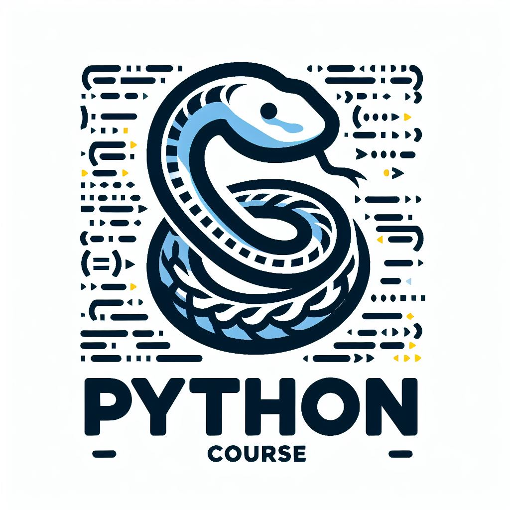

# Curso de Python
## 💪Domina Python y desbloquea tu potencial

    

En el mundo actual, dominar un lenguaje de programación es más que una habilidad, es una necesidad. Python se ha consolidado como una de las herramientas más poderosas y versátiles en el arsenal de cualquier desarrollador, desde aquellos que están dando sus primeros pasos en la programación hasta los profesionales más experimentados. Este curso de Python está diseñado para proporcionar una sólida comprensión de los fundamentos de este lenguaje, así como para explorar sus aplicaciones prácticas en una variedad de contextos.

Abarcaremos los pilares fundamentales de Python, abordando temas esenciales como variables, tipos de datos, estructuras de control y funciones. A medida que avanzamos, exploraremos conceptos más avanzados, incluidos los módulos y paquetes, la manipulación de archivos, el manejo de excepciones y la programación orientada a objetos.

## 📚 Contenido

### Tipos de datos y operadores
- [Tipos de datos](https://nbviewer.org/github/jgcarrillo0/Curso_Python/blob/main/Cuadernos/1_Tipos_de_datos.ipynb)
- [Operaciones básicas](https://nbviewer.org/github/jgcarrillo0/Curso_Python/blob/main/Cuadernos/2_Operaciones.ipynb)
- [Operadores de asignación](https://nbviewer.org/github/jgcarrillo0/Curso_Python/blob/main/Cuadernos/3_Operadores_de_asignacion.ipynb)
- [Operadores de relación](https://nbviewer.org/github/jgcarrillo0/Curso_Python/blob/main/Cuadernos/4_Operadores%20de%20relacion.ipynb)
- [Operadores logícos](https://nbviewer.org/github/jgcarrillo0/Curso_Python/blob/main/Cuadernos/5_Operadores%20logicos.ipynb)
### Estructuras de datos
- [Listas](https://nbviewer.org/github/jgcarrillo0/Curso_Python/blob/main/Cuadernos/6_Listas.ipynb)
- [Tuplas](https://nbviewer.org/github/jgcarrillo0/Curso_Python/blob/main/Cuadernos/7_Tuplas.ipynb)
- [Conjuntos](https://nbviewer.org/github/jgcarrillo0/Curso_Python/blob/main/Cuadernos/8_Conjuntos.ipynb)
- [Diccionarios](https://nbviewer.org/github/jgcarrillo0/Curso_Python/blob/main/Cuadernos/9_Diccionaros.ipynb)
### Estructuras de control
- [Condicional if](https://nbviewer.org/github/jgcarrillo0/Curso_Python/blob/main/Cuadernos/10_Condicional%20if.ipynb)
- [For](https://nbviewer.org/github/jgcarrillo0/Curso_Python/blob/main/Cuadernos/11_For.ipynb)
- [While](https://nbviewer.org/github/jgcarrillo0/Curso_Python/blob/main/Cuadernos/12_While.ipynb)
- [Exception](https://nbviewer.org/github/jgcarrillo0/Curso_Python/blob/main/Cuadernos/13_Excepciones.ipynb)
### Manejo de cadenas de caracteres
- [Manejo básico de cadenas](https://nbviewer.org/github/jgcarrillo0/Curso_Python/blob/main/Cuadernos/14_Manejo%20de%20cadenas.ipynb)
- [Expresiones regulares](https://nbviewer.org/github/jgcarrillo0/Curso_Python/blob/main/Cuadernos/15_Expresiones%20regulares.ipynb)
